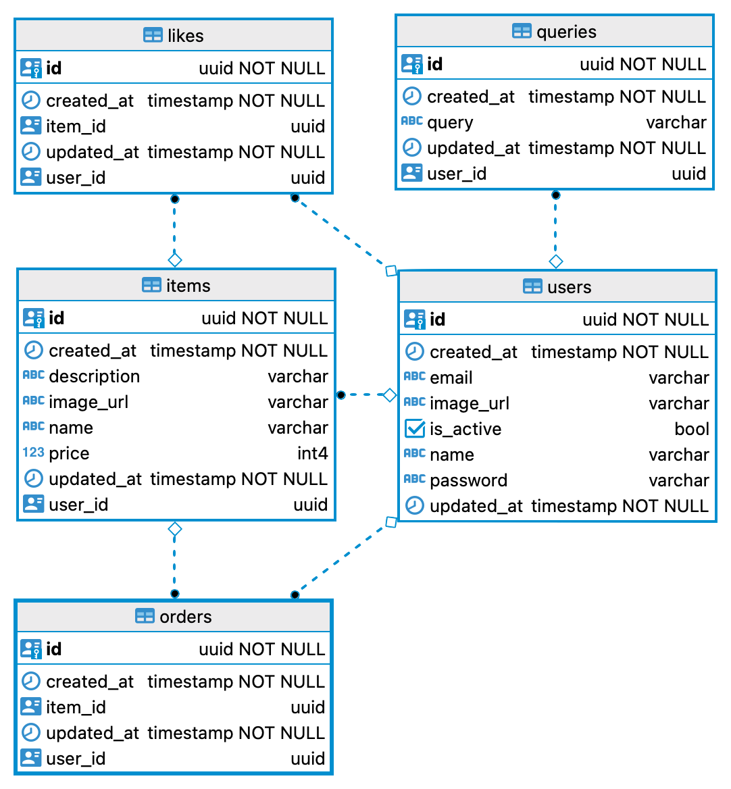

# 📱 Mercari App Clone

  

    
  

  

    
  

Last Updated: 21 February 2022 (JST)

### ℹ️  Info
  - The app is built for Android device/emulator or iOS simulator.
  - If you haven't installed or run the iOS simulator before, follow the [iOS simulator guide](https://docs.expo.dev/workflow/ios-simulator/) before test the app.
  - If you haven't installed or run an Android emulator before, follow the [Android Studio emulator guide](https://docs.expo.dev/workflow/android-studio-emulator/) before test the app.

## 🛠️ Tech stack

- Frontend
  - React Native (Fully Optimized Performance)
  - React Navigation
  - Storybook
  - Atomic Design
  - NativeBase
  - React Query
  - TypeScript
  - i18n
  - Light/Dark Modes
  - expo
- Backend
  - Python (3.10.0)
  - pytest
  - FastAPI
  - OpenAPI (Swagger)
  - SQLAlchemy
  - REST API
  - pydantic
  - Heroku
- Auth
  - OAuth2
  - JWT
  - Password hashing
- DB
  - PostgreSQL
  - Cloudinary
  - Relational Database

## 💾 Database Diagrams

|ERD|Notations|
|---|---|
|||

Last Updated: 14 February 2022 (JST)
